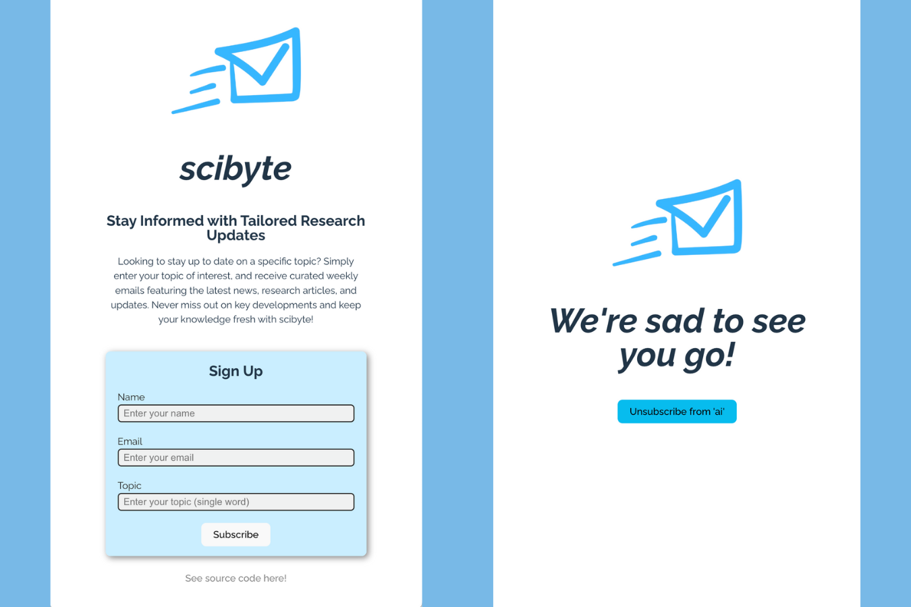

# SciByte: Personalized Research Delivered to Your Inbox

# Demo
Checkout the live site here: [https://scibyte.onrender.com/](https://scibyte.onrender.com/)

_Note_: There are unresolved problems with the Sendgrid API, so demo emails are unavailable at the moment.


# Table of Contents
1. [Introduction](#introduction)
2. [Getting Started](#getting-started)
    - [Prerequisites](#prerequisites)
    - [Installation](#installation)
3. [Program Use](#program-use)
    - [Sample Results](#sample-results)
    - [Custom Deployment](#custom-deployment)
    - [Adding New Sources](#adding-new-sources)

# Introduction
This project was developed to enhance research surveys at the Applied Research Laboratory as part of my summer internship. It is a webscraping application designed to automatically send emails once a week containing curated research on a specific topic. See a demo and the research paper [here](https://capable-cardigan-938.notion.site/SciByte-6a4464f62c414841809daa8dbe0d8c4e)!

### Software Architecture Diagram


# Getting Started
## Prerequistes: 
1. Python 3.8 - 3.12, Node.js and npm
    - __Note__: This program utilizes Python libraries, so ensure that you select the Python interpreter that `pip` installs packages to. To do this in VS Code, enter the Command Palette at the top of the window, and type `>Python: Select Interpreter`
2. Install Newspaper3k Library (Official Guide Here)[https://newspaper.readthedocs.io/en/latest/]
    ```
    $ brew install libxml2 libxslt
    $ brew install libtiff libjpeg webp little-cms2
    $ pip3 install newspaper3k
    $ curl https://raw.githubusercontent.com/codelucas/newspaper/master/download_corpora.py | python3
    $ pip3 install newspaper3k
    $ curl https://raw.githubusercontent.com/codelucas/newspaper/master/download_corpora.py | python3
    ```
    - Note: Newspaper3k utilizes NLTK, whice requires Python versions 3.8, 3.9, 3.10, 3.11, or 3.12. You may need to ensure that your scipy and numpy versions that are compatible.
3. Set up your (SendGrid)[https://sendgrid.com/en-us] Account and Dynamic Template. 
    - Once your account is setup, navigate to 'Email API' -> 'Dynamic Templates' -> 'Create Dynamic Template'
    - Feel free to utilize the files located in `server/services/emailing/sampleTemplates` for your templates.
4. Create and fill in your `.env` file using the `.env.example` file
## Installation: 
1. Clone this repository to your system. In the console, type in `git clone https://github.com/MatthewLabasan/arl-project.git`
2. Create and fill in your `.env` file using the `.env.example` file
3. From the terminal, `cd` to the `client` folder and run `npm install`. Navigate to the `server` folder and run `npm install && pip install -r requirements.txt`
4. Add new website sources following the directions in the next section. Sample websites are already in place if you would like to use them.
5. Run `npm start` in the `client` and `server` folder to start the program! 

# Program Use & Deployment
## Sample Results
### Client Views


*Left*: Homepage, *Right*: Unsubscription Confirmation

### Sample Emails


*Left*: Newsletter, *Right*: Unsubscription Email

## Custom Deployment
To deploy the client, you will need to create an image due to the external system level dependencies needed by the webscrapers. You can use [Docker](https://www.docker.com/get-started/) to assist this, or use a deployment service such as [Heroku](https://devcenter.heroku.com/articles/buildpacks) that has built in system dependency management.

## Adding New Sources
You will want to add new sources to scrape from as users continue to sign up for new keywords. To do this, please ensure that the sources you use fill the following prerequisites:
- Each source should be websites that have a blogpost / news style, such as [this](https://www.theverge.com/). 
- Only website's with <a> href's that are directories (ex. `/topic/article123`) and not full links (ex. `www.website/topic/article123`) are supported.
    - To check this, use the Chrome Inspector tool and hover over a link.
- Be careful with scraping from side bars, the webscraper may not be able to find it.

Now, follow the directions below for guidance:
1. Navigate to `server/server.js` and comment out the following lines of code:
    ```javascript
    // Webscraper & Scheduler
    scheduleScrape() // comment this out

    // Emailer
    scheduleNewsletter() // comment this out
    ```
    This will ensure no emails and extra webscraping processes are completed while testing.
2. Navigate to `server/services/webscraper/websiteData.js` and scroll `/// ADD NEW WEBSITES HERE`
    - Above this, utilize the following template to add your website link, it's homepage, and CSS selector.
    ```javascript
        websiteData.push('yourwebsitelink.com/topic')
        websiteData.push('yourwebsitelink.com')
        websiteData.push('#featured_blurbs > div:nth-child(n) > div > a')
    ```
    - CSS Selector Guidelines:
        - Ensure that the CSS selector ends in the __anchor__ element for link collection. Ex: `div.summary-list__items > div:nth-child(n) > a`
        - The CSS selector must be common to multiple articles ensure all desired links are scraped. 
            - You can do this by using things such as `nth-child`, etc. that will allow you to iterate through multiple articles.

3. [OPTIONAL] Test your new website and the inputted CSS selector to ensure links are being scraped correctly. To test, you can utilize the testing module located in `server/services/webscraper/jsScraper/selectorTest.js`
    - In `server/server.js`, navigate to the follow code:
    ```javascript
    // CSS Selector Testing: See documentation for details.
    // scrapePuppeteer(websiteData)
    ```
    Uncomment `scrapePuppeteer(websiteData)`.
    - Run `npm run dev` to start your server locally.
    - You will see `Puppeteer started successfully.` in your console. Wait for `Selector Test Complete. Please check /server/services/webscraiper/files/links.txt.` to appear.
    - Navigate to that the `links.txt` file and scroll to the bottom to check for your desired links. If your desired links do not appear, your CSS selector is most likely incorrect. See [CSS Selector docs](https://developer.mozilla.org/en-US/docs/Web/CSS/CSS_selectors) for help. Be sure to follow the CSS selector guidelines in Step 2.
4. Once done undo the modifcations to the server.js file done in Step 1 and Step 3. Your code should look like this:
    ```javascript
    // CSS Selector Testing: See documentation for details.
    // scrapePuppeteer(websiteData)

    // Webscraper & Scheduler
    scheduleScrape()

    // Emailer
    scheduleNewsletter()

    ```
5. Commit changes and push to production if necessary.

# Notes
__Logs__: webscraperLog.log will indicate problems that may be occurring with your links, webscraper temp. files, or JSON file creation. 
- Newspaper will continue to run on whatever JSON file is available, even if there was an error with Puppetter. Need to monitor logs to ensure puppeteer ran correctly, else reschedule and fix errors so that puppeteer can update JSON. - Place this in program use.